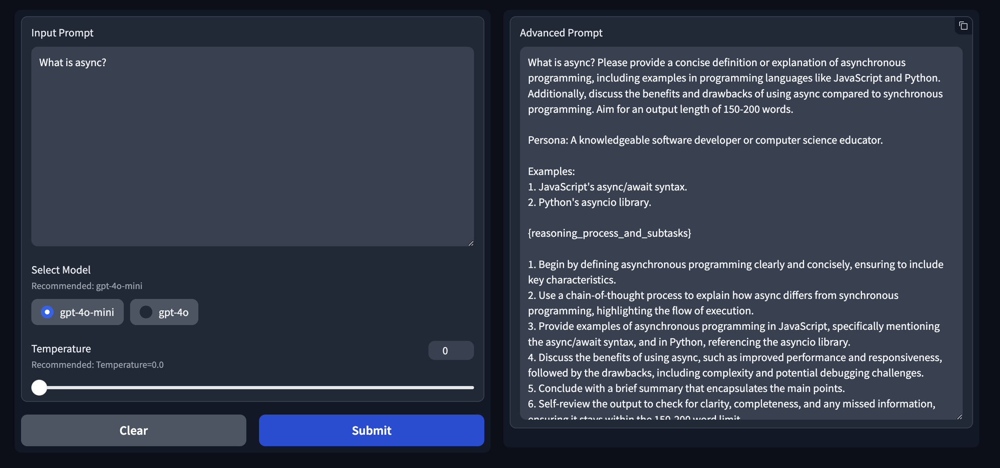

# Advanced Prompt Generator


## Overview
This project is an **LLM-based Advanced Prompt Generator** designed to automate the process of prompt engineering by enhancing given input prompts using large language models (LLMs). Following established prompt engineering principles, the tool can generate advanced prompts with a simple click, leveraging LLM agents for optimized prompt generation.

The tool is deployed using **FastAPI** and **Docker** with an interactive testing interface created using **Gradio** and hosted on **Hugging Face Spaces**.

> ***Note:*** I will add a link to a Medium article soon to dive deep into the idea and details behind this solution. Also, a newer, more optimized, version will be shared soon!

## Key Features
- **LLM-Based Prompt Enhancement:** Utilizes `gpt-4o` /or `gpt-4o-mini` models for generating advanced prompts.
- **Automated Prompt Engineering:** Simplifies prompt engineering processes, requiring minimal user input.
- **FastAPI & Docker Deployment:** Ensures efficient and scalable backend deployment.
- **Gradio Interface:** Provides an easy-to-use interface for testing the prompt generation.
- **Hugging Face Integration:** Hosted on Hugging Face Spaces for public access.

## Next Steps
- **Optimize Solution Architecture:** Improve cost efficiency, reduce latency, and enhance stability and reproducibility (currently in progress).
- **Expand Model Support:** Integrate additional models to offer more variety and flexibility.

---

## Repo Structure

```
├── .gitignore                     # Files and directories to be ignored by Git
├── LICENSE                        # License information for the project
├── README.md                      # Project documentation (this file)
├── Advancd_Prompt_Generator.py    # Script to test the tool locally 
├── pipeline.py                    # Core logic for prompt enhancement
├── requirements.txt               # Python dependencies for the project
├── Docker-FastAPI-app             # Version deployed with FastAPI & Docker
│   ├── app       
│   │   ├── main.py       
│   │   ├── pipeline.py   
│   ├── Dockerfile        
│   ├── requirements.txt  
├── Gradio-app                     # Version deployed with Gradio 
│   ├── app.py            
│   ├── pipeline.py       
│   ├── requirements.txt  
```

---

## Results Examples
## ***Example 1***
### Input Prompt:
What is quantum computing?

### Enhanced Prompt:
Define quantum computing in simple terms, including its key principles such as superposition and ent anglement with clear examples. Discuss its applications in fields like cryptography and drug discovery, providing specific use cases.
Compare quantum computing to classical computing, focusing on how quantum computers can solve certain problems faster. Include at least two recent advancements in the field and their significance. Explore future implications of quantum computing on various industries. Ensure the content is tailored for beginners, using accessible language and avoiding technical jargon.

**AI Model Persona:** A knowledgeable educator in quantum computing.


**Optimal Output Length:** 500-700 words.

**References:** {\
"Quantum Computing for Computer Scientists": \
"This book provides a clear introduction to quantum computing concepts, including superposition and entanglement, making it suitable for beginners. Incorporate it by summarizing key principles and examples from the text to illustrate the differences between quantum and classical computing.";\
"The Quantum World: Quantum Physics for Everyone": \
"This resource simplifies complex quantum concepts for a general audience.
Incorporate it by using its explanations to clarify quantum principles and applications, making the content more accessible to beginners."}

**Tools:**
{}

**Reasoning Process:**
1. Begin with a clear definition of quantum computing, ensuring it is accessible for beginners.
2. Introduce key principles quantum computing:
- Explain superposition with a simple analogy.
- Describe entanglement and its significance in quantum systems.
3. Compare quantum computing to classical computing:
- Provide specific examples of problems that quantum computers can solve faster than classical computers (e.g., factoring large numbers).
- Highlight the limitations of classical computing in certain scenarios.
4. Discuss applications of quantum computing:
- Explain its role in cryptography, emphasizing how it can enhance cybersecurity.
- Describe its potential in drug discovery, including how it can simulate molecular interactions.
5. Include recent advancements in quantum computing:
- Mention notable breakthroughs or developments in the field.
- Reference any significant companies or research institutions leading these advancements.
6. Explore future implications of quantum computing:
- Speculate on how it might transform industries or everyday technology.
- Discuss potential ethical considerations or challenges that may arise.
7. Conclude with a summary that reinforces the importance of understanding quantum computing for the future.
8. Self-review the content to ensure clarity, completeness, and that all key points are addressed for a beginner audience. Check for any missed information or overly complex terminology that may confuse readers.

## ***Example 2***
### Input Prompt:
Pytorch vs Tensorflow?
### Enhanced Prompt:
Compare PyTorch and TensorFlow in terms of key features, pros and cons, and use cases. Include performance metrics and examples of applications in industry. Use a table format for clarity.

**Persona:** knowledgeable data scientist.
**Examples:** "How is PyTorch used in natur al language processing?" and "What are the advantages of TensorFlow in large-scale machine learning projects?"

**Output length:** 500 words. 

**reasoning process_and_subtasks:** 
- Main-task: Compare PyTorch and TensorFlow
- Sub-task 1: Identify key features of PyTorch and TensorFlow
   - Instructions: List and describe the main features of both PyTorch and TensorFlow, focusing on aspects relevant to beginner s and researchers.
   - Success criteria: A clear and concise list of at least 5 key features for each framework.
- Sub-task 2: Analyze pros and cons of PyTorch and TensorFlow
   - Instructions: Create a table that outlines the advantages and disadvantages of both frameworks, ensuring it is easy to rea d and understand for the target audience. 
   - Success criteria: A well-structured table with at least 3 pros and 3 cons for each framework. 
Sub-task 3: Explore use cases for PyTorch and TensorFlow
   - Instructions: Provide examples of specific applications in industry for both frameworks, highlighting their relevance to b eginners and researchers.
   - Success criteria: At least 2 distinct use cases for each framework, with brief descriptions. 
- Sub-task 4: Include performance metrics 
   - Instructions: Research and summarize relevant performance metrics for both PyTorch and TensorFlow, focusing on aspects lik e speed, scalability, and resource efficiency. 
   - Success criteria: A comparative summary of performance metrics for both frameworks, presented in a clear format. 
- Sub-task 5: Format the information into a table 
   - Instructions: Organize all the gathered information (features, pros and cons, use cases, performance metrics) into a cohes ive table format for clarity. 
   - Success criteria: A well-organized table that integrates all the information in a visually appealing manner. 
- Sub-task 6: Ensure optimal output length 
   - Instructions: Review the entire content to ensure it does not exceed 500 words while maintaining clarity and completeness. 
   - Success criteria: The final output is concise, informative, and within the 500-word limit.


---

## Solution Diagrams


---

## Gradio Interface



---

## Getting Started

### Installation
1. Clone the repository:
   ```bash
   git clone https://github.com/Thunderhead-exe/Advanced-Prompt-Generator.git
   ```
2. Install the dependencies:
   ```bash
   pip install -r requirements.txt
   ```
3. Run the app:
   ```bash
   python3 app.py
   ```
---

## License
This project is licensed under the terms of the [apache-2.0 License](LICENSE).

---

## Contributing
Contributions are welcome! Please feel free to submit a Pull Request or open an Issue for any bug reports, feature requests, or general feedback.
