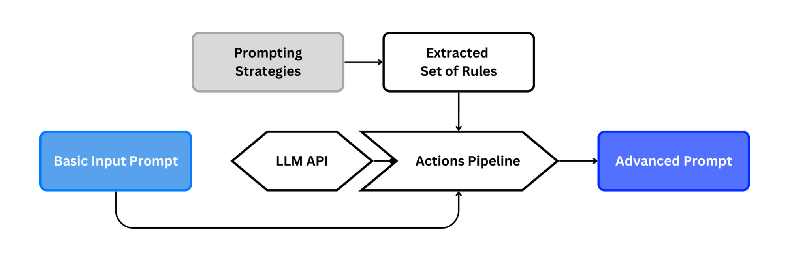
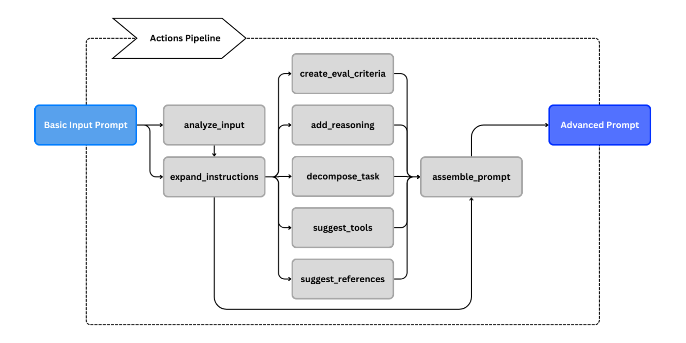
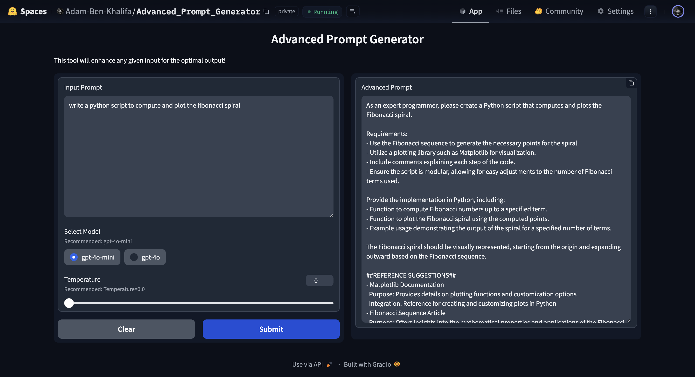

# Advanced Prompt Generator


## Overview
This project is an **LLM-based Advanced Prompt Generator** designed to automate the process of prompt engineering by enhancing given input prompts using large language models (LLMs). Following established prompt engineering principles, the tool can generate advanced prompts with a simple click, leveraging LLM agents for optimized prompt generation.

You can demo this solution on [Hugging Face Spaces](https://huggingface.co/spaces/Adam-Ben-Khalifa/Advanced_Prompt_Generator).

Also you can check this [Medium article](https://medium.com/@AdamBenKhalifa/an-ai-agent-to-replace-prompt-engineers-ed2864e23549) about this solution for more details!

## Key Features
- **Automated Prompt Engineering:** AI Agent based prompt engineering processes, requiring minimal user input.
- **Uses OpenAI APIs:** Support for gpt-4o or gpt-4o-mini (we recommend gpt-4o-mini).
- **FastAPI & Docker Deployment:** Ensures efficient and scalable backend deployment.
- **Gradio Interface:** Provides an easy-to-use interface for testing the prompt generation.
- **Hugging Face Integration:** Hosted on Hugging Face Spaces for quck demo.

## Next Steps
- **Expand Model Support:** Integrate additional models to offer more variety and flexibility.

---

## Repo Structure

```
├── .gitignore                     # Files and directories to be ignored by Git
├── LICENSE                        # License information for the project
├── README.md                      # Project documentation (this file)
├── Advancd_Prompt_Generator.py    # Script to test the tool locally 
├── pipeline.py                    # Core logic for prompt enhancement
├── requirements.txt               # Python dependencies for the project
├── Docker-FastAPI-app             # Version deployed with FastAPI & Docker
│   ├── app       
│   │   ├── main.py       
│   │   ├── pipeline.py   
│   ├── Dockerfile        
│   ├── requirements.txt  
├── Gradio-app                     # Version deployed with Gradio 
│   ├── app.py            
│   ├── pipeline.py       
│   ├── requirements.txt  
```

---

## Results Examples
## ***Example 1***
### Input Prompt:
how to write a book?

### Enhanced Prompt:
As a knowledgeable writing coach, please provide a comprehensive guide on how to write a book.

Requirements:
1. Outline the key steps involved in the book writing process, including brainstorming, outlining, drafting, and revising.
2. Offer tips for maintaining motivation and overcoming writer's block.
3. Include advice on setting a writing schedule and establishing a writing environment.
4. Suggest resources for further learning about writing techniques and publishing options.

Structure your response as follows:
- Introduction to the book writing journey
- Step-by-step guide with actionable tips
- Strategies for motivation and productivity
- Recommended resources for aspiring authors

Keep the response medium in length (approximately 200-300 words) to ensure thorough coverage of the topic.

##REFERENCE SUGGESTIONS##
- "On Writing: A Memoir of the Craft" by Stephen King
  Purpose: Offers insights into the writing process and practical advice for aspiring authors
  Integration: Use as a guide for understanding the nuances of writing a book

- "The Elements of Style" by William Strunk Jr. and E.B. White
  Purpose: Provides essential rules of English style and composition
  Integration: Reference for improving writing clarity and effectiveness

- "Bird by Bird: Some Instructions on Writing and Life" by Anne Lamott
  Purpose: Shares personal anecdotes and practical tips for overcoming writing challenges
  Integration: Use for motivation and strategies to tackle the writing process

##THOUGHT PROCESS##
*Subtask 1*:
- **Description**: Introduce the book writing journey and its significance.
- **Reasoning**: Providing an introduction sets the context for aspiring authors, helping them understand the importance and challenges of writing a book.
- **Success criteria**: The introduction should clearly articulate the purpose of writing a book and inspire readers about the journey ahead.

*Subtask 2*:
- **Description**: Outline the key steps involved in the book writing process: brainstorming, outlining, drafting, and revising.
- **Reasoning**: Breaking down the writing process into clear steps helps authors navigate their journey systematically and reduces overwhelm.
- **Success criteria**: Each step should be defined with actionable tips, such as techniques for brainstorming ideas, structuring an outline, and strategies for effective drafting and revising.

*Subtask 3*:
- **Description**: Provide tips for maintaining motivation and overcoming writer's block.
- **Reasoning**: Addressing common challenges like writer's block is crucial for sustaining progress and ensuring authors remain engaged with their writing.
- **Success criteria**: Include practical strategies, such as setting small goals, taking breaks, and using prompts to reignite creativity.

*Subtask 4*:
- **Description**: Advise on setting a writing schedule and establishing a conducive writing environment.
- **Reasoning**: A structured writing schedule and a supportive environment are essential for productivity and focus during the writing process.
- **Success criteria**: Offer specific recommendations for daily writing routines and tips for creating a distraction-free workspace.

*Subtask 5*:
- **Description**: Suggest resources for further learning about writing techniques and publishing options.
- **Reasoning**: Providing additional resources empowers authors to deepen their knowledge and explore various publishing avenues.
- **Success criteria**: List reputable books, websites, and courses that cover writing skills and the publishing process, ensuring they are accessible and relevant to aspiring authors.

## ***Example 2***
### Input Prompt:
write a python script to compute and plot the fibonacci spiral

### Enhanced Prompt:
As a programming expert, please create a Python script that computes and plots the Fibonacci spiral. 

Requirements:
- Use the Fibonacci sequence to generate the necessary points for the spiral.
- Utilize libraries such as Matplotlib for plotting and NumPy for numerical calculations.
- Include comments explaining each step of the code.
- Ensure the script is modular, allowing for easy adjustments to the number of Fibonacci terms used in the spiral.

Provide the implementation with:
- Function to compute Fibonacci numbers up to a specified term.
- Function to plot the Fibonacci spiral using the computed points.
- Example usage demonstrating the script in action, including a plot display.

The Fibonacci spiral should start with the first few Fibonacci numbers and visually represent the growth of the spiral based on these values.

##REFERENCE SUGGESTIONS##
- Matplotlib Documentation
  Purpose: Provides details on plotting functions and customization options
  Integration: Reference for creating and customizing plots in the script
- Fibonacci Sequence Article
  Purpose: Offers insights into the mathematical properties and applications of the Fibonacci sequence
  Integration: Use as a reference for understanding the sequence's generation and its relation to the spiral
- Python Programming Guide
  Purpose: Serves as a comprehensive resource for Python syntax and libraries
  Integration: Reference for general Python programming practices and functions used in the script

##THOUGHT PROCESS##
*Subtask 1*:
- **Description**: Create a function to compute Fibonacci numbers up to a specified term.
- **Reasoning**: This function is essential for generating the sequence of Fibonacci numbers, which will be used to determine the points for the spiral.
- **Success criteria**: The function should return a list of Fibonacci numbers up to the specified term, with correct values (e.g., for n=5, it should return [0, 1, 1, 2, 3]).

*Subtask 2*:
- **Description**: Implement a function to plot the Fibonacci spiral using the computed points.
- **Reasoning**: Plotting the spiral visually represents the growth of the Fibonacci sequence, making it easier to understand the relationship between the numbers and the spiral shape.
- **Success criteria**: The function should create a plot that accurately represents the Fibonacci spiral, with appropriate axes and labels, and should display the plot correctly.

*Subtask 3*:
- **Description**: Include comments explaining each step of the code.
- **Reasoning**: Comments enhance code readability and maintainability, allowing others (or the future self) to understand the logic and flow of the script.
- **Success criteria**: The code should have clear, concise comments that explain the purpose of each function and key steps within the functions.

*Subtask 4*:
- **Description**: Ensure the script is modular, allowing for easy adjustments to the number of Fibonacci terms used in the spiral.
- **Reasoning**: Modularity allows users to easily modify the number of terms without altering the core logic of the script, enhancing usability and flexibility.
- **Success criteria**: The script should allow the user to specify the number of Fibonacci terms as an input parameter, and the plot should update accordingly.

*Subtask 5*:
- **Description**: Provide example usage demonstrating the script in action, including a plot display.
- **Reasoning**: Example usage helps users understand how to implement and run the script, showcasing its functionality and output.
- **Success criteria**: The example should include a clear demonstration of how to call the functions, specify the number of terms, and display the resulting plot, with expected output shown.

---

## Solution Diagrams



---

## Gradio Interface

---

## Getting Started

### Installation
1. Clone the repository:
   ```bash
   git clone https://github.com/Thunderhead-exe/Advanced-Prompt-Generator.git
   ```
2. Install the dependencies:
   ```bash
   pip install -r requirements.txt
   ```
3. Run the app:
   ```bash
   python3 Advancd_Prompt_Generator.py
   ```
---

## License
This project is licensed under the terms of the [apache-2.0 License](LICENSE).

---

## Contributing
Contributions are welcome! Please feel free to submit a Pull Request or open an Issue for any bug reports, feature requests, or general feedback.
